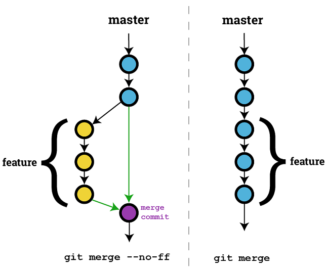

# Git Introduce
Create by [huang.xinghui](http://huang-x-h.github.io/) / [@Github](https://github.com/huang-x-h)

---

# Agenda

- Basic Usage
- Review History
- Undo
- Merge
- Gitlab Flow

---

Git 是一个分散式版本控制软件，最初由 Linus Torvalds 创作，于2005年以GPL开源。最初目的是为更好地管理Linux内核开发而设计

[Wikipedia](https://zh.wikipedia.org/wiki/Git)

---

# Git 优点

- 本地的版本管理
- 超轻量级分支创建
- 强大的Merge功能
- 世界最大的开源社区 [Github](https://github.com/)

---

# Introduce

先介绍几个概念

 - Working Directory 工作目录
 - Staging 暂存区域
 - Local Repository 本地仓库
 - Remote Repository 远程仓库

---

# Introduce

Woking Directory/Staging/Local Repository/Remote Repository 关系转换

---

# Git flow

基本的 `Git` 流程

1. 在工作目录中修改文件
2. 暂存文件，将文件的快照放入暂存区域
3. 提交更新，找到暂存区域的文件，将快照永久性存储到 `Git` 仓库目录

---

# Git flow

`Git` 操作文件的状态变化周期

---

# git add

	$ git add <file>

新增文件到暂存区域

	$ git add .

新增所有变化内容到暂存区域

---

# git commit

	$ git commit
	
提交更新

	$ git commit -a [-m 'msg']
	
提交所有变化文件除了未被追踪的

	$ git commit --amend [-m 'msg']
		
修改最后一次提交信息 (可用在漏提交内容或者提交信息写错)

---

# git rm & mv

	$ git rm <file>

从工作目录删除文件并记录快照放入暂存区域

	$ git rm --cached <file>

同上，但是工作目录保留该文件

	$ git mv [file-original] [file-renamed]

移动文件名称并记录快照放入暂存区域

---

# git status

	$ git status

显示所有新增/修改文件状态变化
- 暂存区域与当前HEAD提交之间不同的文件
- 工作目录与暂存区域之间不同的文件
- 工作目录未曾被 `git` 追踪的文件

---

# git remote

	$ git remote -v
	
查看所有远程服务地址信息

	$ git remote add remote_name <url>
	
	

	$ git pull origin <branch>
	
拉取远程仓库分支代码

	$ git push origin <branch>

推送本地分支所有记录到远程仓库

---

# git stash

	$ git stash

临时储藏所有修改的追踪文件，将新的储藏推送到栈上

	$ git stash pop

恢复最新的文件存储

	$ git stash list

查看储藏

	$ git stash drop

应用储藏然后立即从栈上扔掉它

---

# Branch

分支管理

---

# Locale Branch

	$ git branch

查看当前仓库所有本地分支

	$ git branch <branch-name>

创建分支

	$ git checkout <branch-name>

切换分支

	$ git branch -d <branch-name>

删除分支

---

# Remote Branch

	$ git push origin :featureA

删除远程分支

	$ git checkout -b featureA origin/featureA

创建本地分支，并且起点位于 `origin/featureA`

---

实际使用还会需要查看历史，回退文件版本，分支合并，冲突

---

# Review History 

查看历史

- git log
- git show
- git diff

---

# git log & show

	$ git log

查看当前分支版本历史

	$ git log <file>

查看指定文件版本历史, 追加 `--follow` 则包括重命名的版本历史

	$ git show <commit>

查看提交记录修改内容信息

---

# git diff

	$ git diff

查看暂存前后的变化

	$ git diff --cached (`--cached` 和 `--staged` 是同义词)

查看已经暂存起来的变化

	$ git diff <commit1> <commit2>

查看提交记录之间的变化	
	
	$ git diff [first-branch]...[second-branch]

查看分支之间的变化

---

# git diff file

	$ git diff <file_name>

查看文件暂存前后的变化

	$ git diff --staged <file_name>
	
查看文件已经暂存起来的变化
	
	$ git diff <commit1> <commit2> <file_name>

查看文件提交记录之间的变化

---

# Undo
回退操作

- git reset
- git revert
- git checkout

---

# git reset

`git reset` 在当前分支上撤销一些 `commit`
	
	$ git reset --hard HEAD
	
回退暂存前的修改

	$ git reset <commit>

回退版本到该记录版本，并在工作目录下保留该记录之后的修改

	$ git reset --hard <commit>

回退版本到该记录版本，不保存该记录之后的修改

---

# git reset file

	$ git reset HEAD <file>
	
取消文件暂存

---

# git revert

	$ git revert <commit>

`git revert` 命令通过创建一次新的 `commit` 来撤销一次 `commit` 所做出的修改

这种方法更加安全，因为它并不修改提交记录

---

# git checkout file

	$ git checkout -- <file>
	
取消文件工作目录上的修改

	$ git checkout <commit> <file_name>

回退文件到指定版本，放入暂存区域

---

# Merge
合并

- git merge
- git rebase

---

# git merge

	$ git merge <branch-name>

合并分支到当前分支

	$ git merge --no-ff <branch-name>
	
使用 `--no-ff` 参数后，会执行正常合并，在当前分支上生成一个新节点

---

---

合并时遇到冲突怎么办

---

	$ git mergetool
	
Use your configured merge tool to solve conflicts

---

# Merge - git rebase

---

# Gitlab flow

开发流程，分为两种

- Original repository
- Fork repository

---

# Original repository

--

克隆仓库

	$ git clone https://gitlab.com/gitlab-org/helloworld.git

--

创建分支

	$ git checkout -b featureA

--	

实现处理

	$ git add/commit(change implementation)	
	
--

提交分支

	$ git push origin featureA
	
--

提交 MergeRequest

--

安排人员代码走查，测试验证

--

合并 MergeRequest

--

删除分支

	$ git branch -D featureA

--

更新本地分支

	$ git pull origin master
	
---

# Fork repository

--

Fork 仓库

--

克隆 Fork 仓库

	$ git clone https://gitlab.com/huang.xinghui/helloworld.git

--

关联上游版本库

	$ git remote add upstream https://gitlab.com/gitlab-org/helloworld.git

--

创建分支

	$ git checkout -b featureA

--

实现处理

	$ git add/commit(change implementation)	

--

提交分支

	$ git push origin featureA

--

提交 MergeRequest

--

安排人员代码走查，测试验证

--

合并 MergeRequest

--

删除分支

	$ git branch -D featureA

--

同步上游版本库内容

	$ git checkout master
	$ git pull upstream master

---

# Git - Bonus

	$ git config --global credential.helper store

保存 HTTPS 协议用户名密码

	$ git blame <file_name>
	
查看文件每行代码的作者

---

# Resource

- [github-git-cheat-sheet](https://training.github.com/kit/downloads/github-git-cheat-sheet.pdf)
- [git-cheatsheet](http://ndpsoftware.com/git-cheatsheet.html)
- [Pro Git中文版](https://git-scm.com/book/zh/v2)

---

# THE END
						
谢谢