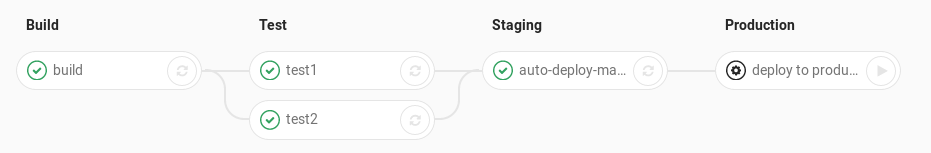

# Gitlab 实战

Create by [huang.xinghui](http://huang-x-h.github.io/) / [@Github](https://github.com/huang-x-h)

---

# Agenda

- Basic Usage
- Gitlab Flow
- Gitlab CI
- Gitlab Pages
- Gitlab Bonus

---


https://about.gitlab.com/

---

# Gitlab Flow

- 本地的版本管理
- 超轻量级分支创建
- 强大的Merge功能
- 世界最大的开源社区 [Github](https://github.com/)

---

# Gitlab CI

Q: What is CI ?

A: Continuous Integration is a software development practice where members of a team integrate their work frequently ... verified by an automated build (including test) to detect integration errors as quickly as possible. 

-- [Martin Fowler](https://www.martinfowler.com/articles/continuousIntegration.html)

---

# GitLab Continuous Integration


---

Q: How to start Gitlab CI ?

A: `.gitlab-ci.yml`

---

# What is `.gitlab-ci.yml`

The `.gitlab-ci.yml` file is where you configure what CI does with your project. It lives in the **root of your repository**.

---

# .gitlab-ci.yml

```yml
# This file is a template, and might need editing before it works on your project.
# Official framework image. Look for the different tagged releases at:
# https://hub.docker.com/r/library/node/tags/
image: node:latest

# This folder is cached between builds
# http://docs.gitlab.com/ce/ci/yaml/README.html#cache
cache:
  paths:
  - node_modules/

test_async:
  script:
   - npm install
   - node ./specs/start.js ./specs/async.spec.js
```

---

# Core Concepts

- pipelines
- stages
- jobs

---

# What is Pipelines

A pipeline is a group of jobs that get executed in stages(batches). All of the jobs in a stage are executed in parallel (if there are enough concurrent Runners), and if they all succeed, the pipeline moves on to the next stage. If one of the jobs fails, the next stage is not (usually) executed.

---



---

# What is Stages

`stages` is used to define stages that can be used by jobs. 

The ordering of elements in stages defines the ordering of jobs' execution:

1. Jobs of the same stage are run in parallel.
2. Jobs of the next stage are run after the jobs from the previous stage complete successfully.

---

```yml
stages:
  - build
  - test
  - deploy
```

---

# What is Jobs

A job is defined by a list of parameters that define the job behavior.

`.gitlab-ci.yml` allows you to specify an unlimited number of jobs. Each job must have a **unique name**, which is not one of the keywords mentioned above.

---

```yml
job_name:
  script:
    - rake spec
    - coverage
  stage: test
  only:
    - master
  except:
    - develop
  tags:
    - ruby
    - postgres
  allow_failure: true
```
---

- `script` is a shell script which is executed by the Runner
- `stage` allows to group jobs into different stages. Jobs of the same `stage` are executed in `parallel`
- `only` and `except` are two parameters that set a job policy to limit when jobs are created
...

---

About `.gitlab-ci.yml` configuration

See more https://docs.gitlab.com/ce/ci/yaml/README.html

---

# What is Gitlb Runner ?

GitLab Runner is used to run your jobs and send the results back to GitLab

- Shared Runner
- Specific Runner

See more https://docs.gitlab.com/runner/

---

# Why would i need my own Runner ?

- you need to compile the software for Windows or OS X, not for linux
- you are creating some confidential data during the build
...

---

# Using specific runner

- Install GitLab Runner 
- Register GitLab Runner
- Selecting the executor

---

# Gitlab Pages

Q: What is GitLab Pages?

A: Create websites for your GitLab projects, groups, or user account.

---

| Type of GitLab Pages | The name of the project created in GitLab |Website URL |
| --- | --- | --- |
| User pages | username.example.io | http(s)://username.example.io |
| Group pages | groupname.example.io | http(s)://groupname.example.io |
| Project pages owned by a user | projectname | http(s)://username.example.io/projectname |
| Project pages owned by a group | projectname | http(s)://groupname.example.io/projectname |

---

# Create Gitlab Pages

1. Create a project
2. Push a `.gitlab-ci.yml` file in the root directory of your repository with a specific job named **`pages`**
3. Set up a GitLab Runner to build your website


Your also can fork one of example websites hosted by GitLab Pages https://gitlab.com/groups/pages

---

```yml
pages:
  script:
    - my_commands
  artifacts:
    paths:
      - public
```

1. A special job named pages must be defined
2. Any static content which will be served by GitLab Pages must be placed under a public/ directory
3. artifacts with a path to the public/ directory must be defined

See more https://docs.gitlab.com/ee/user/project/pages/introduction.html

---

# Gitlab Bonus

	

---

# Resource

- [github-git-cheat-sheet](https://training.github.com/kit/downloads/github-git-cheat-sheet.pdf)
- [git-cheatsheet](http://ndpsoftware.com/git-cheatsheet.html)
- [Pro Git中文版](https://git-scm.com/book/zh/v2)
- [常用 Git 命令清单](http://www.ruanyifeng.com/blog/2015/12/git-cheat-sheet.html)

---

# THE END
						
谢谢