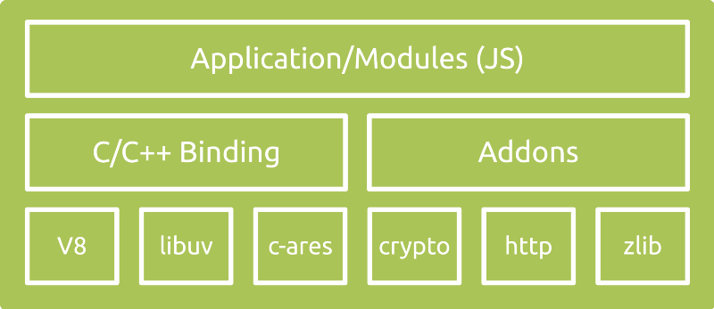

# Node Introduce
Create by [huang.xinghui](http://huang-x-h.github.io/) / [@Github](https://github.com/huang-x-h)

---

# Agenda

- 什么是 Node.js 
- Node.js 能做什么
- Node.js 特性
- Node.js 生态环境

---

## 什么是 Node.js

---

Node.js is a JavaScript runtime built on Chrome's V8 JavaScript engine. 

Open-source, cross-plaform JavaScript runtime environment.

---

简单来说，Node.js 就是服务端 JavaScript

---

## Backgroud

- 2009年由 Ryan Dahl 创建
- 由 Node.js Foundation 维护
- 开源在 [github](https://github.com/nodejs/node)

> [Wiki Detail](https://en.wikipedia.org/wiki/Node.js)

---

## Node.js 能做什么

---

## 读写文件 File System

```js
const fs = require('fs');
fs.readFile('/etc/password', (err, data) => {
  if (err) throw err;
  console.log(data);
});
```

---

## 创建 HTTP Server

```js
const http = require('http');
http.createServer((req, res) => {
  res.writeHead(200, {'Content-Type': 'text/plain'});
  res.end('Hello World\n');
}).listen(3000);  
```

---

## 创建 TCP Server

```js
const net = require('net');
net.createServer((socket) => {
  socket.write('Echo Server');
  socket.on('data', function(data) {
    socket.write(data);
  });
});
```

---

## 访问数据库 mongodb

```js
const mongoose = require('mongoose');
mongoose.connect('mongodb://127.0.0.1:27017/node_chat', function (error) {
  if (error) {
    console.log(error);
  }
});

// Mongoose Schema definition
const Schema = mongoose.Schema;
var UserSchema = new Schema({
  username: String,
  password: String
});

// Mongoose Model definition
var User = mongoose.model('users', UserSchema);

User.find({}, function (err, users) {
  console.log(users);
});
```

---

## Node.js 有哪些特性

---

## 程序性能耗费大部分是等待IO处理上


---

## 处理方式大致有如下几种

- synchronous 同步处理 (这样处理某个请求会阻塞其他请求)
- fork a new process 多进程处理 (新起进程处理请求，太耗资源)
- threads 多线程处理 (新起线程处理请求，也耗资源，多线程时常要考虑资源抢占)

---

那么 Node.js 是怎么处理的呢

---

Node.js uses an event-driven, non-blocking I/O model that makes it lightweight and efficient. 

---

## Node.js 特性
- event-driven 事件驱动
- non-blocking I/O 非阻塞 I/O
- single-threaded 单线程

---

## 术语解释
- I/O (Input/Output) 一般指和硬盘/驱动器等交互
- Non-blocking 通常一个请求服务进来，应用处理该请求，会暂停其他操作一直到请求处理结束。当请求过多时就会阻塞，验证影响应用使用
- Event-Driven 常用在和UI应用交互，典型的应用场景：JavaScript和DOM交互

---


---

看看 Node.js 的架构设计图


---

- v8 高性能JavaScript引擎，Google出品，Chrome也用
- [libev](http://software.schmorp.de/pkg/libev.html) C语言库，提供异步特性，包含事件轮询/文件处理/网络处理/线程池等
- Application/Modules Node.js核心模块
- Bindings 提供JavaScript和Node.js里C/C++代码交互
- C/C++ Addons Node.js内部核心库 (zlib/OpenSSL等)

---

Node.js 

擅长于处理I/O密集型任务和实时性的任务

不擅长处理CPU密集型任务

---

## Node.js 生态系统

[npm](https://www.npmjs.com/) (Node Package Manager)

提供所有开源模块，如 express.js/socket.io

---

Node.js 目前版本维护信息

https://github.com/nodejs/LTS

---

使用Node.js的公司有 GoDaddy, Groupon, IBM, LinkedIn, Microsoft, Netflix, PayPal, Walmart 等等.

---

Jeff Atwood, co-founder of Stack Overflow 曾写过这样一句话

> any application that can be written in JavaScript, will eventually be written in JavaScript

---

那还有什么理由不去使用呢 :)

---

## Resource

- [Node.js官网](https://nodejs.org/en/)
- [NodeSchool.io](http://nodeschool.io/)
- [Node入门](http://www.nodebeginner.org/index-zh-cn.html)
- [Understanding the Node.js Event Loop](https://nodesource.com/blog/understanding-the-nodejs-event-loop/)
- [Architecture of Node.js’ Internal Codebase](https://medium.com/yet-another-node-js-blog/architecture-of-node-js-internal-codebase-57cd8376b71f)

---

## Any Questions?

---

## THE END
						
谢谢